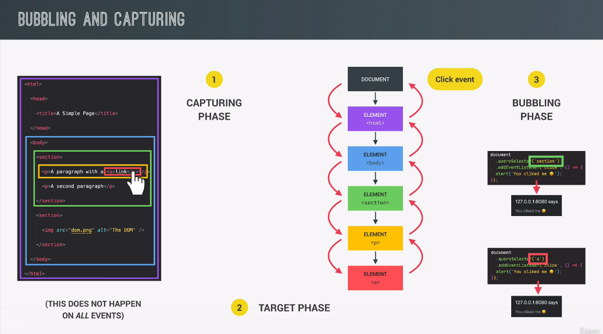
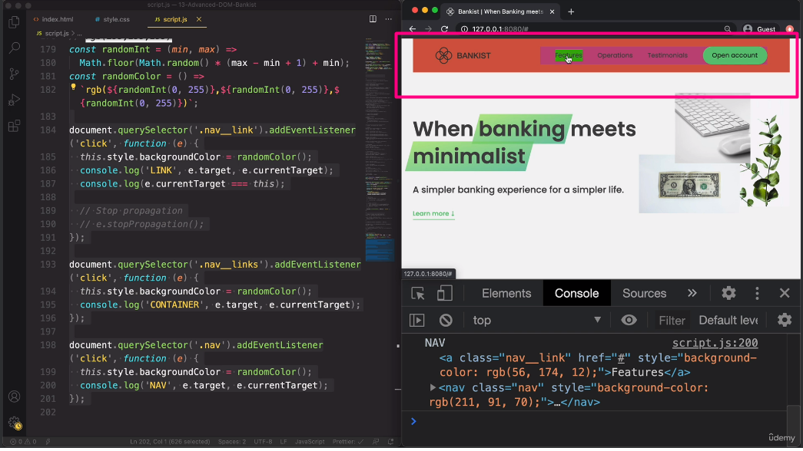

Event propagation

// event listeners work in 3 phase

// when we click on the element then click event is generated at top of the dom tree that is in the document
// 1.capturing phase:-when event move from document to child where handler is attached
// 2.target phase:-when event reaches targeted child
// 3.bubbling phase:-when event moves up again to the document

// all these event handlers gets triggers (fire) in bubbling phase

